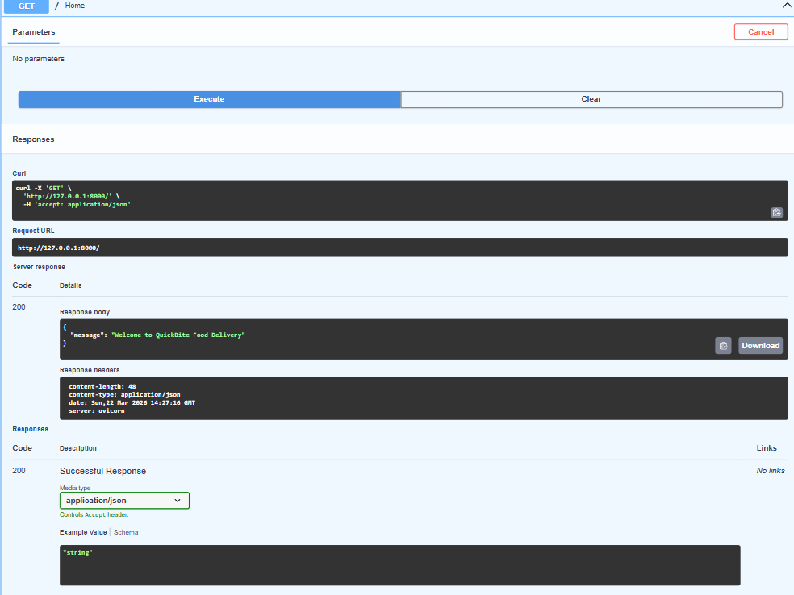
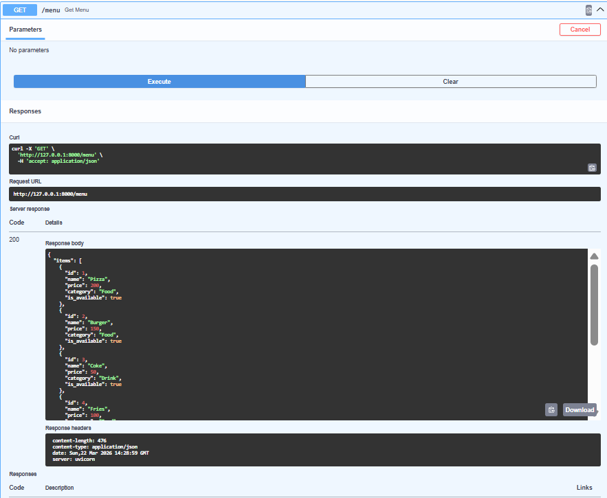
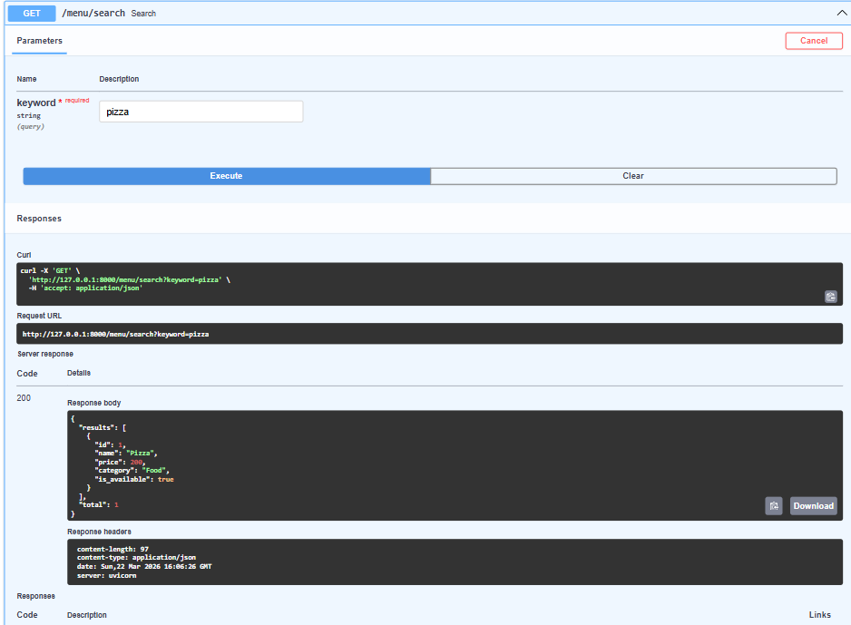
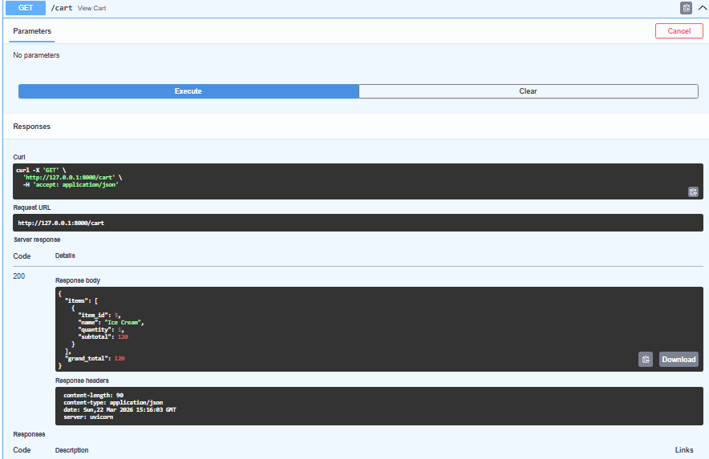
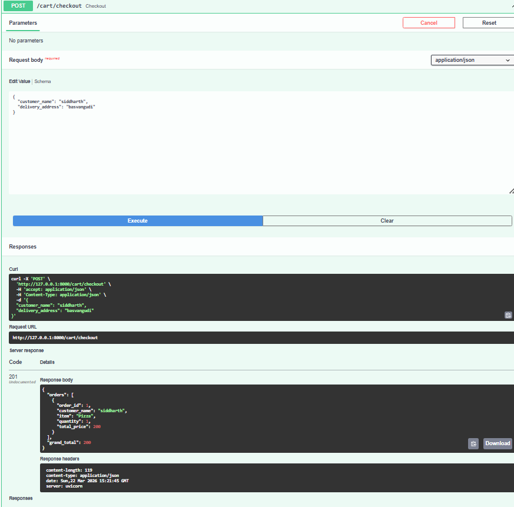
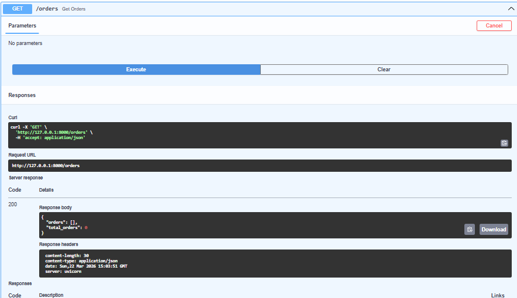

# 🍔 FastAPI Food Delivery Backend

🚀 A complete backend system built using **FastAPI** that simulates a real-world **Food Delivery Application**.

---

## 📌 Project Overview

This project implements a fully functional backend for a food delivery platform where users can:

- Browse menu items 🍕  
- Search and filter food 🔍  
- Add items to cart 🛒  
- Checkout orders 💳  
- Track orders 📦  

It demonstrates real-world backend workflows using REST APIs.

---

## ⚙️ Tech Stack

- 🐍 Python  
- ⚡ FastAPI  
- 📦 Pydantic  
- 🚀 Uvicorn  
- 🧪 Swagger UI  

---

## ✨ Key Features

### 🍕 Menu Management
- View all menu items  
- Get item details by ID  
- Add, update, and delete items  

---

### 🔍 Smart Browsing
- Search items by keyword  
- Filter by category, price, availability  
- Sort items (ascending / descending)  
- Pagination support  
- Combined browsing endpoint  

---

### 🛒 Cart System
- Add items to cart  
- Update quantity automatically  
- Remove items from cart  
- View cart summary  

---

### 💳 Checkout Workflow
- Place orders from cart  
- Generate multiple orders per checkout  
- Clear cart after checkout  
- Track all orders  

---

## 📸 Screenshots

### 🏠 Home API


### 🍕 Menu API


### 🔍 Search Functionality


### 🛒 Cart View


### 💳 Checkout Process


### 📦 Orders Output


---

## ▶️ How to Run the Project

```bash
pip install -r requirements.txt
uvicorn main:app --reload